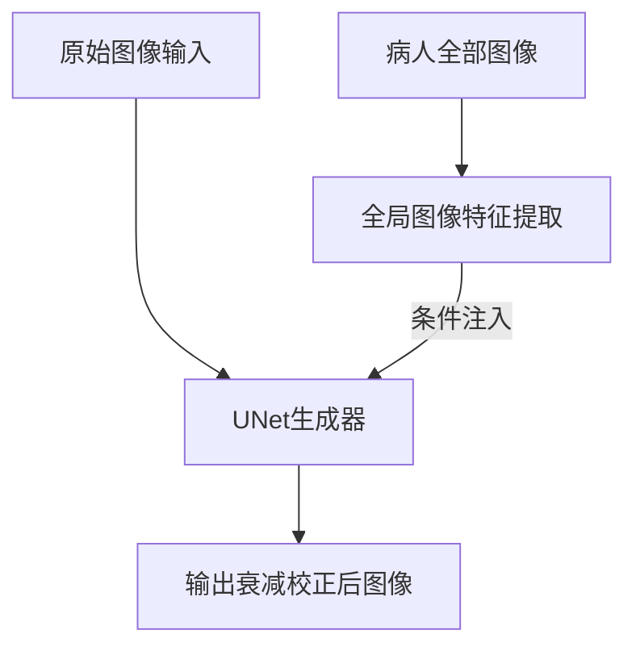
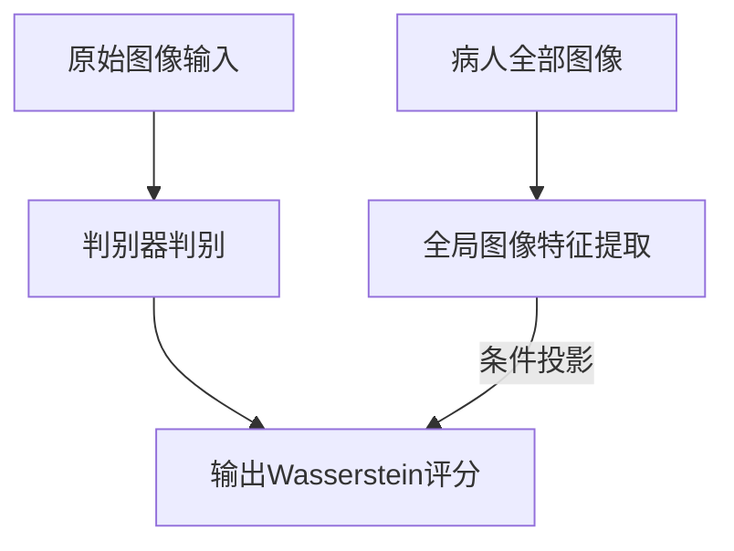

# 流程图

## 生成器

```mermaid
graph TD
    A[原始图像输入] ---> B[UNet生成器]
    B --> C[输出衰减校正后图像]
    D[病人全部图像] --> E[全局图像特征提取]
    E -- 条件注入 --> B
```

## 判别器

```mermaid
graph TD
    A[原始图像输入] --> B[判别器判别]
    B --> C[输出Wasserstein评分]
    D[病人全部图像] --> E[全局图像特征提取]
    E -- 条件投影 --> C
```
